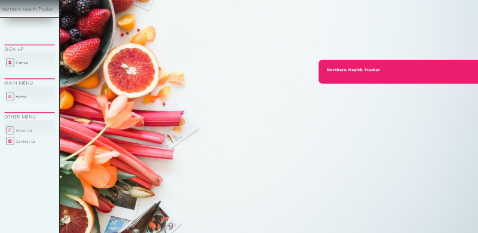

# Northern Fitness Tracker


<p align="center">
    
    
</p>
<p align="center">
    
    
    
    
    
    
    
    
</p>


## Overview

A Fitness Tracker project is a application that allows that user to track their progress on their choosen weekly workout and guides users set goals for a healtheir life style.  
Essenitially, users will use this site to input weekly health data. The weekly health data includes details about your steps, calories consumed, water intake, and the amount of sleep one has. Once this data is entered, the data is then converted into graphical data for the user to look at. It comparaes the habits of the user to that of the average person.

## Table of Contents

- [Overview](#overview)
- [Authors](#authors)
- [Preview](#preview)
- [Demo](#demo)
- [Guest Login](#guest-login)
- [Features](#features)
- [Contribution](#contribution)
- [License](#license)
- [Bugs](#bugs)

## Authors

- Sophia Kiani: [soph-k](https://github.com/soph-k)
- Cole Enyart: [ColeEnyart](https://github.com/ColeEnyart)
- Bret Petersen: [bretpeters3n](https://github.com/bretpeters3n)
- Bentura Peralez: [BenturaPeralez](https://github.com/BenturaPeralez)

## Preview



## Demo

[Demo](https://northern-health-tracker2.herokuapp.com/)

## Guest Login

Username / Email:
email@email.com

Password:
Test1234!

## Features

- HTML
- CSS
  - Bootstrap
- Javascript
  - jQuery
- Node.js
- SQL
- Heroku Deployment
- Chart.js

<!-- GETTING STARTED -->
## Getting Started
These are instructions on setting up this project locally on your machine. To get a local copy up and running follow these simple example steps.


### Prerequisites
Make sure you have the latest installation of NPM (Node Package Manager) by following this step.
* Install/update NPM
   ```sh
   npm install npm@latest -g
   ```


### Installation
1. Clone the repo
   ```sh
   git clone https://github.com/bretpeters3n/northern-health-tracker.git
   ```
2. Install NPM packages
   ```sh
   npm install
   ```
3. Run project
   ```sh
   npm run start
   ```

<p align="right">(<a href="#top">back to top</a>)</p>

## Test

No testing has been set up yet.

## Contribution

Contributions are accepted. Feel free to fork without permission.

## License

This project is under the MIT license.

### Questions

For questions about this project, please review GitHub repo at [Northern Health Tracker](https://github.com/bretpeters3n/northern-health-tracker) or contact one of the authors on Github.

#### Bugs

No known bugs.
